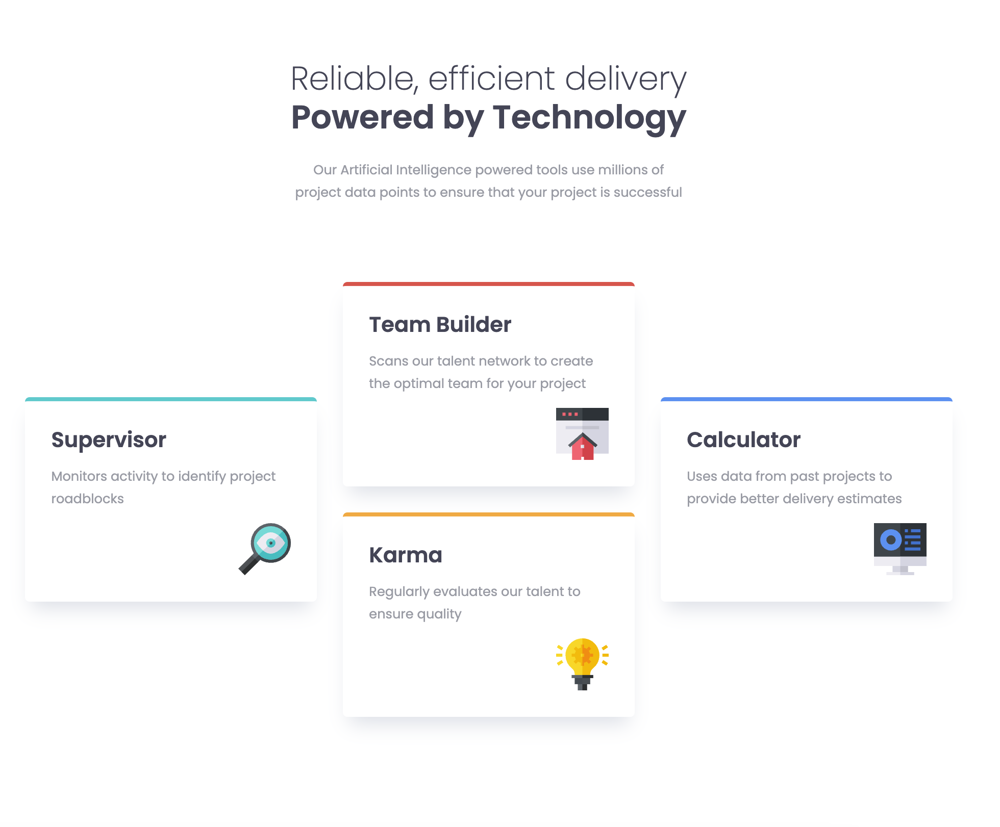

# Frontend Mentor - Four card feature section solution

### Description

This is a solution to the [Four card feature section challenge on Frontend Mentor](https://www.frontendmentor.io/challenges/four-card-feature-section-weK1eFYK).

### Features

- View the optimal layout for the site depending on their device's screen size.

### Built With

- Semantic HTML5.
- CSS.
- BEM.

### Links

- GitHub URL: [https://github.com/norrland90/four-card-feature-section]
- Live Site URL: [https://norrland90.github.io/four-card-feature-section]

### Acknowledgement

- This is made with the help of and youtube tutorial by Kevin Powell: [https://www.youtube.com/watch?v=JFbxl_VmIx0]

### Contact

Created by [@norrland90](https://github.com/norrland90) - feel free to contact me!
